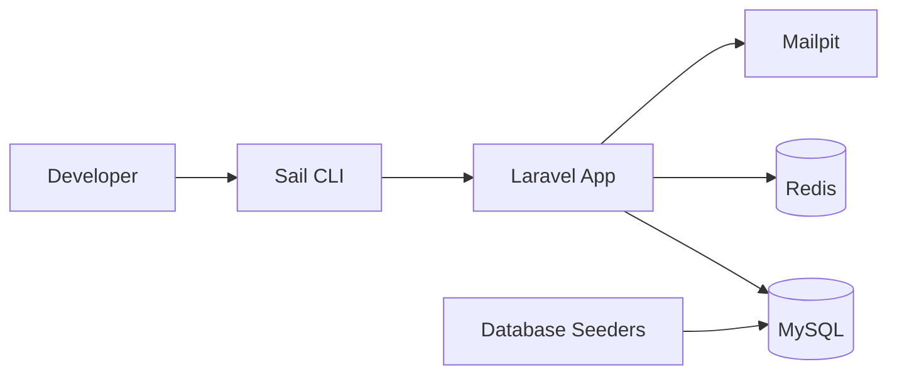

<div class="hero-section technical-guide">
  <div class="hero-content">
    <div class="hero-icon">🐳</div>
    <h1>Desarrollo Local con Laravel Sail</h1>
    <h2>Entorno Docker para el proyecto</h2>
    <div class="hero-badges">
      <div class="badge laravel">🐳 Docker + Sail</div>
      <div class="badge php">🗄️ MySQL 8.4</div>
      <div class="badge status">📬 Mailpit</div>
    </div>
    <p class="hero-description">
      Guía para levantar el proyecto con contenedores Docker usando Laravel Sail
    </p>
  </div>
</div>

## Requisitos

- [Docker Desktop](https://www.docker.com/products/docker-desktop/) instalado y en ejecución
- [Composer](https://getcomposer.org/) (solo si `vendor/` no está presente)

## Arquitectura local



### Servicios incluidos

| Servicio | Contenedor | Puerto (host) | Descripción |
|----------|------------|---------------|-------------|
| Laravel App | `laravel.test` | 80 | Aplicación principal |
| MySQL | `mysql` | 3306 | Base de datos |
| Redis | `redis` | 6379 | Cache y colas |
| Mailpit | `mailpit` | 8025 (UI), 1025 (SMTP) | Correo de desarrollo |

## Instalación inicial

```bash
git clone https://github.com/AlexHu65/laravel-saas-ai-documents.git
cd laravel-saas-ai-documents

composer install
cp .env.example .env
php artisan key:generate

./vendor/bin/sail up -d
./vendor/bin/sail artisan migrate:fresh --seed
```

`sail up -d` ejecuta automáticamente `php artisan migrate --force` y `php artisan db:seed --force` al iniciar el contenedor `laravel.test`. El comando `migrate:fresh --seed` solo es necesario cuando quieres borrar la base y reconstruir todos los datos demo.

## Comandos frecuentes

```bash
# Levantar / detener contenedores
./vendor/bin/sail up -d
./vendor/bin/sail down

# Base de datos
./vendor/bin/sail artisan migrate
./vendor/bin/sail artisan migrate:fresh --seed

# Tests y desarrollo
./vendor/bin/sail artisan test
./vendor/bin/sail shell
./vendor/bin/sail npm install
./vendor/bin/sail npm run dev
```

### Alias opcional

```bash
alias sail='sh $([ -f sail ] && echo sail || echo vendor/bin/sail)'
```

Con el alias puedes usar `sail up -d` en lugar de `./vendor/bin/sail up -d`.

## URLs locales

| Servicio | URL / Host |
|----------|------------|
| Aplicación | http://localhost |
| Mailpit | http://localhost:8025 |
| MySQL (desde tu máquina) | `127.0.0.1:3306` |
| MySQL (desde contenedor) | host `mysql` |
| Redis (desde contenedor) | host `redis` |

## Variables de entorno (`.env`)

```env
DB_CONNECTION=mysql
DB_HOST=mysql
DB_PORT=3306
DB_DATABASE=laravel_saas_ai_documents
DB_USERNAME=sail
DB_PASSWORD=password

REDIS_HOST=redis

MAIL_MAILER=smtp
MAIL_HOST=mailpit
MAIL_PORT=1025
```

## Datos demo (seeders)

Ejecuta `./vendor/bin/sail artisan migrate:fresh --seed` para cargar datos determinísticos.

**Contraseña de todos los usuarios demo:** `password`

| Email | Empresa | Rol |
|-------|---------|-----|
| admin@acme.test | Acme Corporation | admin |
| manager@acme.test | Acme Corporation | manager |
| user@acme.test | Acme Corporation | user |
| admin@globex.test | Globex Industries | admin |
| user@globex.test | Globex Industries | user |
| admin@initech.test | Initech Solutions | admin |

### Modelos sembrados

- `Role` — admin, manager, user
- `Feature` — ai_generate, export_pdf, collaboration, analytics, priority_support
- `Plan` — Basic, Pro, Enterprise (con pivote `feature_plan`)
- `Company` — 3 empresas demo
- `User` — 6 usuarios con roles asignados
- `Subscription` — suscripciones activas y canceladas
- `Document` — documentos en estados draft, processing, completed
- `AIUsage` — registros de consumo de tokens por empresa/usuario

## Troubleshooting

### Docker no está corriendo

```
Error: Cannot connect to the Docker daemon
```

Abre Docker Desktop y espera a que esté listo antes de ejecutar `sail up`.

### Puerto 80 o 3306 ocupado

Edita `.env` y ajusta los puertos:

```env
APP_PORT=8080
FORWARD_DB_PORT=3307
```

Luego reinicia: `./vendor/bin/sail down && ./vendor/bin/sail up -d`

### Permisos en `storage/` o `bootstrap/cache/`

```bash
./vendor/bin/sail shell
chmod -R 775 storage bootstrap/cache
```

### La base de datos no conecta

Verifica que los contenedores estén saludables:

```bash
./vendor/bin/sail ps
```

Espera a que MySQL termine de iniciar antes de migrar. Si falla, prueba:

```bash
./vendor/bin/sail artisan migrate:fresh --seed
```

### Ver correos enviados

Abre http://localhost:8025 en el navegador (Mailpit).

## Enlaces relacionados

- [Guía Técnica](./GUIA_TECNICA.html)
- [Diagrama Entidad-Relación](./DIAGRAMA_ENTIDAD_RELACION.html)
- [Multi-Tenancy](./MULTI_TENANCY.html)
- [Roles y Permisos](./ROLES_PERMISOS.html)
