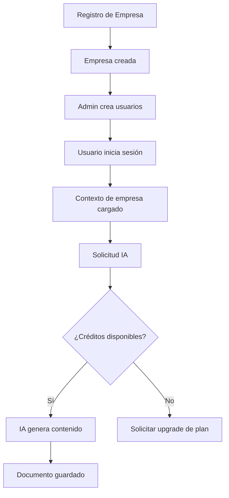

# 🔄 Flujo de Negocio – Laravel SaaS AI Documents

---

## 🧠 Objetivo

Documentar el flujo real de uso del sistema en un contexto B2B (México / LATAM), mostrando:

- Cómo interactúa una empresa con el sistema
- Dónde entra la IA
- Cómo se controlan los créditos
- Cómo se conecta con el modelo de suscripción

---

## 🏢 Escenario Real (B2B México)

Empresa ejemplo:
Despacho contable, consultoría, agencia o constructora que necesita generar documentos internos y externos con apoyo de IA.

---

## 🚀 Flujo General del Sistema

```text
Empresa se registra
    ↓
Se crea registro en companies
    ↓
Admin crea usuarios
    ↓
Usuario inicia sesión
    ↓
Middleware detecta company_id
    ↓
Contexto de empresa activo
    ↓
Usuario solicita generación con IA
    ↓
Sistema valida plan y créditos
    ↓
IA genera contenido
    ↓
Documento se guarda




