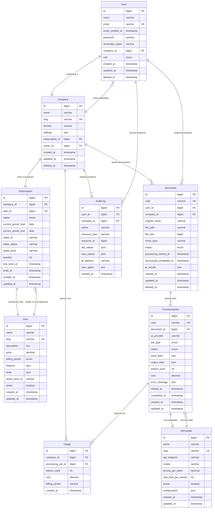

# Diagrama Entidad-Relación - Laravel SaaS AI Documents

## Estado Actual
⚠️ **El proyecto no tiene modelos implementados aún**. Este ERD representa la **arquitectura planificada** basada en el análisis del dominio SaaS AI Documents.

## Diagrama ERD (Mermaid)



## Descripción de Entidades

### 👤 User (Usuarios)
**Propósito**: Gestión de usuarios del sistema con roles y permisos.
- **Relaciones**: Pertenece a una Company, puede tener múltiples Documents
- **Características**: Soft deletes, verificación email, multi-rol por empresa
- **Consideraciones**: Implementar con Laravel's built-in authentication

### 🏢 Company (Empresas/Organizaciones)
**Propósito**: Multi-tenancy - cada empresa es independiente.
- **Relaciones**: Tiene Users, Documents, Subscription, Usage
- **Características**: Slug único, dominio personalizado, configuraciones JSON
- **Consideraciones**: Core del multi-tenancy, todas las operaciones filtradas por company_id

### 💳 Subscription (Suscripciones)
**Propósito**: Gestión de pagos y límites de uso por empresa.
- **Relaciones**: Pertenece a Company y Plan
- **Características**: Integración Stripe, períodos de facturación, trials
- **Consideraciones**: Usar Laravel Cashier para Stripe

### 📋 Plan (Planes de Suscripción)
**Propósito**: Definición de características y límites por plan.
- **Relaciones**: Usado por Subscriptions
- **Características**: Límites JSON (documentos/mes, tokens IA), precios
- **Consideraciones**: Features y limits como JSON para flexibilidad

### 📄 Document (Documentos)
**Propósito**: Archivos cargados para procesamiento IA.
- **Relaciones**: Pertenece a User y Company, genera ProcessingJobs
- **Características**: UUID público, metadatos de archivo, resultados IA
- **Consideraciones**: Usar UUID para exposición pública, soft deletes

### ⚙️ ProcessingJob (Jobs de Procesamiento IA)
**Propósito**: Registro de cada operación IA realizada.
- **Relaciones**: Pertenece a Document y AIProvider, genera Usage
- **Características**: Tracking tokens, costos, errores, tiempos
- **Consideraciones**: Crucial para facturación y debugging

### 🤖 AIProvider (Proveedores de IA)
**Propósito**: Configuración de servicios IA (OpenAI, Claude, etc).
- **Relaciones**: Usado por ProcessingJobs
- **Características**: Rate limits, precios, configuraciones específicas
- **Consideraciones**: Permite intercambiar proveedores fácilmente

### 📊 Usage (Uso/Consumo)
**Propósito**: Tracking detallado para facturación y límites.
- **Relaciones**: Pertenece a Company, generado por ProcessingJob
- **Características**: Agregación por período facturación
- **Consideraciones**: Optimizar para queries de facturación

### 📝 AuditLog (Auditoría)
**Propósito**: Trazabilidad completa de acciones del sistema.
- **Relaciones**: Referencias User y Company
- **Características**: Valores antes/después, metadatos de sesión
- **Consideraciones**: Usar package como spatie/laravel-activitylog

## Índices Recomendados

### Índices Críticos para Performance
```sql
-- Users
INDEX idx_users_company_id ON users(company_id);
INDEX idx_users_email ON users(email);

-- Documents  
INDEX idx_documents_company_id ON documents(company_id);
INDEX idx_documents_user_id ON documents(user_id);
INDEX idx_documents_uuid ON documents(uuid);
INDEX idx_documents_status ON documents(status);

-- Processing Jobs
INDEX idx_processing_jobs_document_id ON processing_jobs(document_id);
INDEX idx_processing_jobs_status ON processing_jobs(status);
INDEX idx_processing_jobs_created_at ON processing_jobs(created_at);

-- Usage (crucial para facturación)
INDEX idx_usage_company_billing ON usage(company_id, billing_period);
INDEX idx_usage_created_at ON usage(created_at);
```

## Consideraciones de Implementación

### 1. Multi-tenancy
- **Todos los modelos principales** deben incluir `company_id`
- **Global scopes** para filtrar automáticamente por empresa
- **Middleware** para establecer contexto de empresa

### 2. Procesamiento Asíncrono
- **Queue Jobs** para processing_jobs
- **Event/Listeners** para actualizar Usage
- **Notification system** para completion status

### 3. Soft Deletes
- Implementar en: User, Company, Document
- **No implementar** en: ProcessingJob, Usage (datos históricos)

### 4. JSON Fields
- `Company.settings`: configuraciones específicas
- `Plan.features`: características del plan
- `Plan.limits`: límites numéricos
- `Document.ai_results`: resultados del procesamiento
- `ProcessingJob.input_data/output_data`: parámetros y resultados

### 5. Seguridad
- **UUID públicos** para Documents (no exponer IDs internos)
- **Rate limiting** basado en company y plan
- **Validation** estricta en uploads de documentos

## Próximos Pasos

1. **Crear migraciones** siguiendo este ERD
2. **Implementar modelos** con relaciones Eloquent
3. **Configurar factories y seeders** para testing
4. **Establecer policies** para autorización
5. **Crear observers** para auditoría automática

## Comandos para Implementar

```bash
# Crear migraciones en orden
php artisan make:migration create_companies_table
php artisan make:migration create_plans_table  
php artisan make:migration create_subscriptions_table
php artisan make:migration create_users_table
php artisan make:migration create_ai_providers_table
php artisan make:migration create_documents_table
php artisan make:migration create_processing_jobs_table
php artisan make:migration create_usage_table
php artisan make:migration create_audit_logs_table

# Crear modelos con relaciones
php artisan make:model Company -c
php artisan make:model Plan -c
php artisan make:model Subscription -c
php artisan make:model Document -c
php artisan make:model ProcessingJob -c
php artisan make:model AIProvider -c
php artisan make:model Usage -c
php artisan make:model AuditLog -c
```
