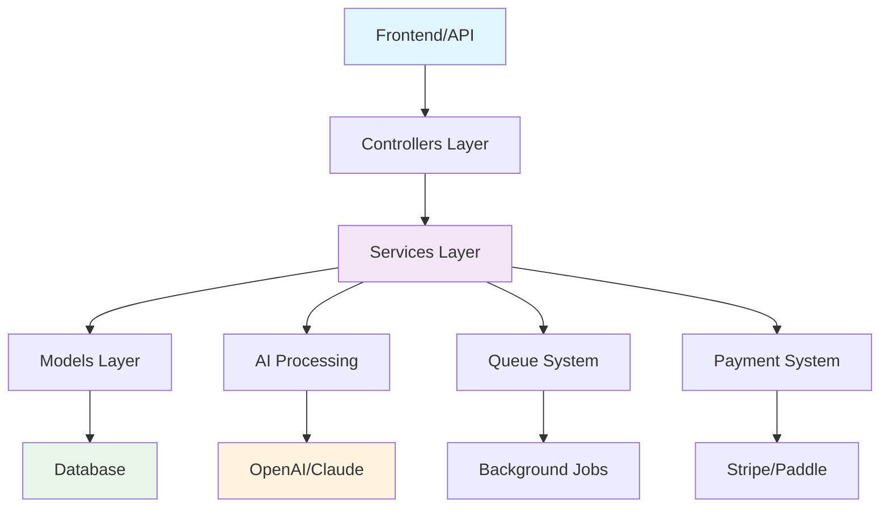

# Laravel SaaS AI Documents
## Documentación Técnica Completa

---

## 🎯 Visión General del Proyecto

**Laravel SaaS AI Documents** es una plataforma SaaS diseñada para el procesamiento inteligente de documentos corporativos utilizando tecnologías de inteligencia artificial. El proyecto implementa una arquitectura multi-tenant que permite a múltiples empresas operar de forma independiente con sus propios usuarios, documentos y límites de uso.

### Estado Actual
- ✅ **Framework**: Laravel 11.31 instalado
- ⚠️ **Estado**: Proyecto esqueleto - Sin funcionalidad implementada  
- 📋 **Documentación**: Completa y lista para desarrollo
- 🎯 **Objetivo**: Core de procesamiento IA + Sistema SaaS

---

## 📚 Documentación Disponible

### 🏗️ [Arquitectura del Proyecto](./ARQUITECTURA_PROYECTO.md)
Descripción completa de la arquitectura técnica, stack tecnológico, módulos planificados y dependencias críticas.

**Incluye:**
- Stack tecnológico detectado
- Estructura de capas planificada
- Módulos futuros requeridos
- Dependencias críticas faltantes
- Recomendaciones arquitectónicas

---

### 🤖 [Guía de Operación para IA](./GUIA_IA_PROYECTO.md)
Manual completo para que cualquier IA pueda operar seguramente en el proyecto desde el primer día.

**Incluye:**
- Reglas de modificación de archivos
- Convenciones del proyecto
- Flujo de trabajo recomendado
- Manejo de dependencias
- Scripts útiles y comandos

---

### 🗄️ [Diagrama Entidad-Relación](./DIAGRAMA_ENTIDAD_RELACION.md)
Modelo de datos completo con diagramas Mermaid, descripción de entidades y consideraciones de implementación.

**Incluye:**
- ERD completo en Mermaid
- Descripción de 9 entidades principales
- Índices recomendados
- Consideraciones de implementación
- Comandos para crear migraciones

---

### 📄 [Resumen para IA](./RESUMEN_PROYECTO_IA.md)
Contexto condensado optimizado para uso como referencia persistente en sesiones de IA.

**Incluye:**
- Contexto del proyecto (25 líneas)
- Entidades principales
- Flujos críticos
- Reglas que la IA debe respetar

---

### 📊 [Metadatos Estructurados](./METADATOS_PROYECTO.json)
Archivo JSON con todos los metadatos del proyecto para referencia programática.

**Incluye:**
- Stack tecnológico completo
- Dependencias actuales y requeridas
- Entidades planificadas con relaciones
- Rutas actuales y módulos planificados
- Riesgos identificados y recomendaciones

---

## 🚀 Primeros Pasos

### Para Desarrolladores
1. **Leer** [Arquitectura del Proyecto](./ARQUITECTURA_PROYECTO.md) para comprender la visión técnica
2. **Revisar** [Diagrama ERD](./DIAGRAMA_ENTIDAD_RELACION.md) para el modelo de datos
3. **Implementar** migraciones siguiendo las especificaciones
4. **Configurar** servicios de IA y autenticación

### Para IA/Asistentes
1. **Cargar** [Resumen para IA](./RESUMEN_PROYECTO_IA.md) como contexto base
2. **Consultar** [Guía de Operación](./GUIA_IA_PROYECTO.md) para reglas y convenciones
3. **Referenciar** [Metadatos JSON](./METADATOS_PROYECTO.json) para datos estructurados
4. **Seguir** las reglas de modificación de archivos

---

## 📋 Estado del Proyecto

### ✅ Completado
- [x] Instalación Laravel 11.31
- [x] Configuración básica del proyecto
- [x] Documentación técnica completa
- [x] Definición de arquitectura
- [x] Modelo de datos planificado

### 🔄 En Progreso
- [ ] Implementación de modelos y migraciones
- [ ] Configuración de sistema de autenticación
- [ ] Integración con servicios de IA

### ⏳ Planificado
- [ ] Sistema multi-tenant
- [ ] Procesamiento asíncrono de documentos
- [ ] API REST completa
- [ ] Dashboard administrativo
- [ ] Sistema de facturación

---

## 🛠️ Stack Tecnológico

| Componente | Tecnología | Estado |
|------------|------------|---------|
| **Backend** | Laravel 11.31 + PHP ^8.2 | ✅ Instalado |
| **Base de Datos** | MySQL/PostgreSQL | ⏳ Por configurar |
| **IA Processing** | OpenAI/Claude APIs | ⏳ Por integrar |
| **Autenticación** | Laravel Breeze/Jetstream | ⏳ Por instalar |
| **Pagos** | Stripe/Paddle | ⏳ Por configurar |
| **Queues** | Redis/Database | ⏳ Por configurar |
| **Storage** | AWS S3/Local | ⏳ Por configurar |
| **Frontend** | Blade/Livewire/Vue | ⏳ Por decidir |

---

## 🏗️ Arquitectura Planificada

---

## 📞 Información de Contacto

- **Proyecto**: Laravel SaaS AI Documents
- **Versión**: 0.1.0 (Estado Inicial)
- **Documentación**: [GitHub Pages](https://alexhu65.github.io/laravel-saas-ai-documents/)
- **Repositorio**: [GitHub Repository](https://github.com/alejandrochavez/laravel-saas-ai-documents)

---

## 📝 Notas Importantes

> ⚠️ **Estado del Proyecto**: Este proyecto está en estado inicial. La documentación representa la arquitectura planificada, no la implementación actual.

> 📋 **Para Desarrolladores**: Seguir estrictamente las especificaciones del ERD y las convenciones documentadas.

> 🤖 **Para IA**: Consultar la Guía de Operación antes de realizar cualquier modificación en el código.

---

*Última actualización: {{ site.time | date: "%Y-%m-%d" }}*
